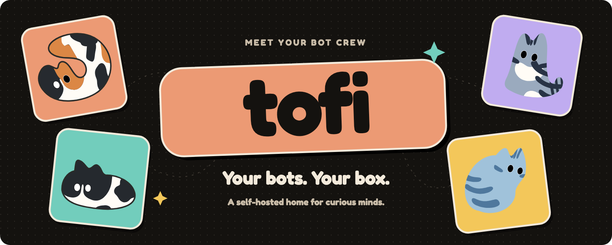

<p align="center"></p>

<p align="center">Persistent bots, conversations and connected tools — on your own server.</p>

Tofi is a self-hosted Go server with a React Web client. Bots keep their identity,
conversations, scheduled work and tool connections in a persistent workspace.

- Direct and group conversations, streaming replies, attachments and generated files.
- Persistent queues, scheduled work, cancellation and retry handling.
- Bot configuration, memory and collaboration across conversations.
- MCP and Skills management, credentials and supported OAuth connections.
- Invite-only accounts, Admin management and per-account data isolation.
- A guarded single-node Worker for independent account cloud computers and disk quotas.

## Install on your own server

You need a dedicated Linux x86_64 server or VM **with KVM** (`/dev/kvm`): Ubuntu
22.04/24.04 or Debian 12/13, at least 2 vCPUs, 4 GiB RAM and 30 GiB free disk
(8 GiB RAM and 40 GiB recommended). Each account gets its own Firecracker
computer, so nested virtualization must be enabled on cloud VMs.

```sh
curl -fsSL https://raw.githubusercontent.com/JackZhao98/tofibot/main/install.sh | sudo bash
```

In a terminal the installer first shows what it found on the machine (OS, CPU,
RAM, disk, Docker, KVM, ports, existing install, addresses). It then asks how
account computers run (KVM/Firecracker today; gVisor and plain containers are
listed as not supported yet) and how you will open TOFI (by IP with self-signed
HTTPS, a domain with automatic HTTPS, or this machine only). It also asks for
the port, and the default for each question is marked. A summary follows,
together with `Proceed? [Y/n]`, and nothing is changed before you confirm.
Ctrl-C or `n` leaves the machine untouched. For automation, add `--yes` (or set
`CI`), and answer with flags or `TOFI_*` variables; the full table is in
`deploy/self-host/README.md`. Then the script installs Docker if needed,
downloads a release whose images and files are pinned by digest and checksum,
and starts TOFI. It prints
the addresses and a one-time **setup key**; enter the key on the first page to
create the Admin account, then open Settings -> Model provider.

By default TOFI serves HTTPS with a self-signed certificate on every interface,
so you open it straight from your browser at `https://<server-ip>:8321` (like
Proxmox on `:8006`). The browser warns about the certificate the first time:
compare the SHA-256 fingerprint the installer printed, then continue. On a cloud
server, allow TCP 8321 in its firewall or security group. Other choices:

```sh
# Public HTTPS with a trusted certificate (ports 80/443, DNS pointing here)
curl -fsSL https://raw.githubusercontent.com/JackZhao98/tofibot/main/install.sh | sudo bash -s -- --domain tofi.example.com --email you@example.com
# This server only (127.0.0.1, still HTTPS); reach it with ssh -L 8321:127.0.0.1:8321
curl -fsSL https://raw.githubusercontent.com/JackZhao98/tofibot/main/install.sh | sudo bash -s -- --local-only
# No questions (scripts, cloud-init): flags and defaults only
curl -fsSL https://raw.githubusercontent.com/JackZhao98/tofibot/main/install.sh | sudo bash -s -- --yes --port 8321
```

Afterwards use `sudo tofi status | start | stop | update | computers | logs |
doctor | setup-secret | regenerate-cert | uninstall`. `tofi update` keeps your data and restores the previous
version automatically if the new one does not come up. `tofi uninstall` keeps all
data; `tofi uninstall --purge` deletes it. Details: `deploy/self-host/README.md`.

```sh
sudo tofi status                    # versions (installed / latest), services, every account computer
sudo tofi update --check            # what an update would change; exit 0 up to date, 10 available
sudo tofi update                    # apply it (rolls back by itself if the new version fails)
sudo tofi computers                 # each computer: state, Guest release, pending upgrade, memory, last wake
sudo tofi computers upgrade --all   # move idle computers off an older Guest; busy ones are deferred
```

## Build and run from source

Requirements: Docker with Compose. This development configuration builds from
this checkout:

```sh
docker compose up -d --build
```

Open `http://127.0.0.1:8321`. This basic Compose configuration runs the App and
shared MCP Runner. It does **not** provision the isolated account Worker or the
per-account computers; use the server install above for that. Keep persistent
volumes; removing them deletes their data. Configure authentication and a trusted
ingress before exposing a service beyond loopback.

For local development, install Go matching `go.mod` and Node matching the Web
build dependencies:

```sh
npm --prefix ui ci
npm --prefix ui run build
go build ./cmd/tofi ./cmd/tofi-guest
```

## Account cloud computers

The account runtime uses a Linux x86_64 host with KVM, tun, cgroup v2, AppArmor
and Docker Compose. Its confined Worker owns guest lifecycle, resource admission
and per-account disks; attachments and generated files share the cloud-disk
quota. Chat database storage has a separate safety bound. The server install
(`install.sh`, `deploy/self-host/`) sets this up; portable account environment
export/import between hosts is not part of it.

## Project boundary

This repository contains Server, Web UI, API contracts and Docker/Worker source.
The Electron/macOS client is maintained separately and is not included. The Web
build can produce a versioned UI artifact for that client with
`scripts/export-desktop-ui.cjs`; the consumer verifies the artifact contract and
file checksums without compiling another copy of Web source.

Private deployment packets, operational acceptance data, historical design
exports, runtime volumes and credentials are excluded from this source tree.
No deployment or live service upgrade occurs when this source is published.

## Licensing

TOFI is split into two licenses:

- **Server, installer and everything outside `ui/`**: [Apache-2.0](LICENSE).
- **Web app (`ui/`)**: [PolyForm Shield 1.0.0](ui/LICENSE). Source is visible
  and you may use and modify it to run TOFI, but not to build a competing
  product.

Third-party Web dependency notices are in `ui/THIRD_PARTY_NOTICES.md` and
`ui/public/licenses`. The header uses the project's original four-cat artwork
and Fredoka lettering; the font notice is in `assets/OFL-Fredoka.txt`.
