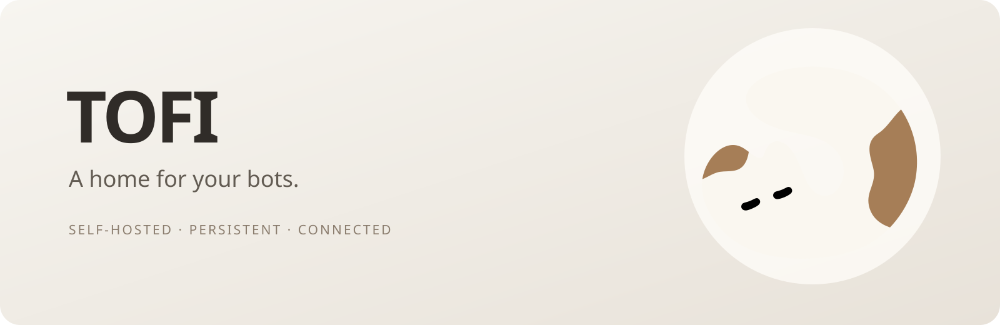

<p align="center"></p>

<p align="center">Persistent bots, conversations and connected tools — on your own server.</p>

Tofi is a self-hosted Go server with a React Web client. Bots keep their identity,
conversations, scheduled work and tool connections in a persistent workspace.

- Direct and group conversations, streaming replies, attachments and generated files.
- Persistent queues, scheduled work, cancellation and retry handling.
- Bot configuration, memory and collaboration across conversations.
- MCP and Skills management, credentials and supported OAuth connections.
- Invite-only accounts, Admin management and per-account data isolation.
- A guarded single-node Worker for independent account cloud computers and disk quotas.

## Build and run

Requirements: Docker with Compose for the basic deployment. No published TOFI
image is required: build from this checkout.

```sh
docker compose up -d --build
```

Open `http://127.0.0.1:8321`. This basic Compose configuration runs the App and
shared MCP Runner. It does **not** provision the isolated account Worker. Keep
persistent volumes; removing them deletes their data. Configure authentication
and a trusted ingress before exposing a service beyond loopback.

For local development, install Go matching `go.mod` and Node matching the Web
build dependencies:

```sh
npm --prefix ui ci
npm --prefix ui run build
go build ./cmd/tofi ./cmd/tofi-guest
```

## Account cloud computers

The account runtime uses an explicitly reviewed Linux x86_64 host with KVM, tun,
cgroup v2, AppArmor and Docker Compose. Its confined Worker owns guest lifecycle,
resource admission and per-account disks; attachments and generated files share
the cloud-disk quota. Chat database storage has a separate safety bound.

`deploy/self_host.py` is an **unfinished installer draft**. Integrity, locking,
failure recovery and clean-host installation acceptance are incomplete. Do not
apply it or assume the basic Compose command enables the account cloud computers.
Existing Worker/migration source is included for review and development. Portable
account environment export/import is not implemented.

## Project boundary

This repository contains Server, Web UI, API contracts and Docker/Worker source.
The Electron/macOS client is maintained separately and is not included. The Web
build can produce a versioned UI artifact for that client with
`scripts/export-desktop-ui.cjs`; the consumer verifies the artifact contract and
file checksums without compiling another copy of Web source.

Private deployment packets, operational acceptance data, historical design
exports, runtime volumes and credentials are excluded from this source tree.
No deployment or live service upgrade occurs when this source is published.

## Licensing

This source repository is currently private. Project license selection is pending. See Web dependency notices in
`ui/THIRD_PARTY_NOTICES.md` and bundled dependency notices under `ui/public/licenses`.
The header uses the project’s existing cat logo; no photographic reference assets
are included. No open-source release has been made; publication awaits an explicit later decision and a confirmed license.
